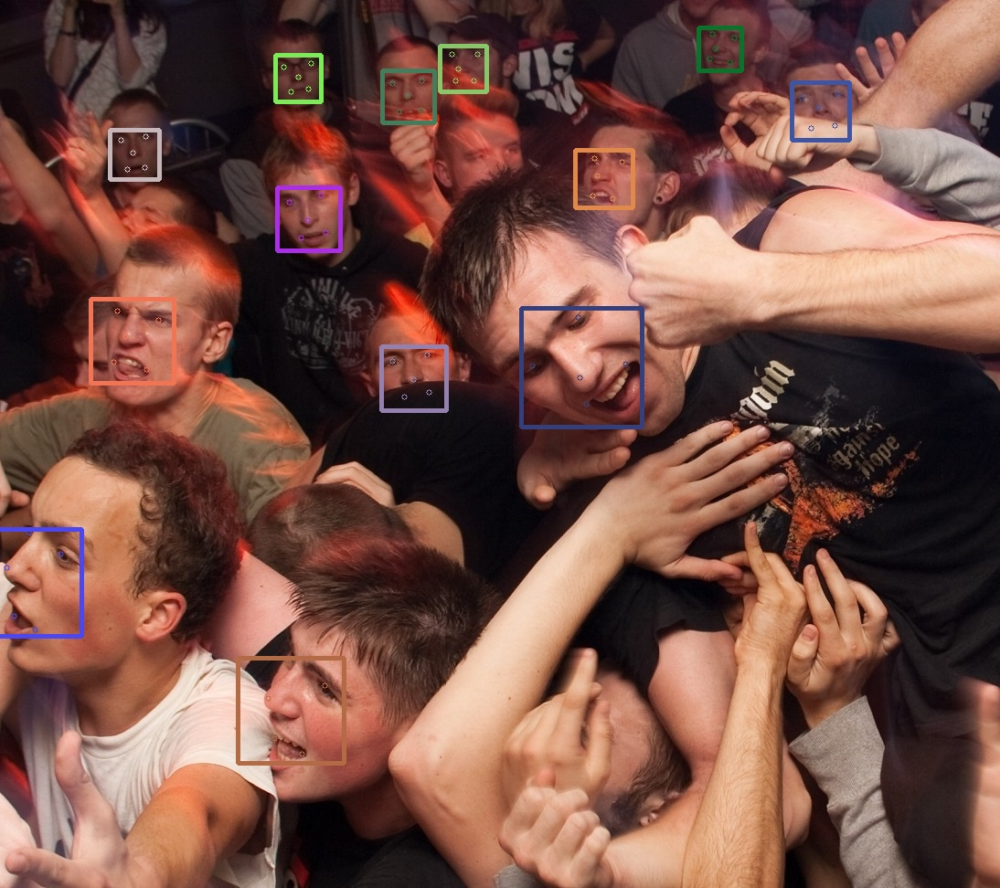
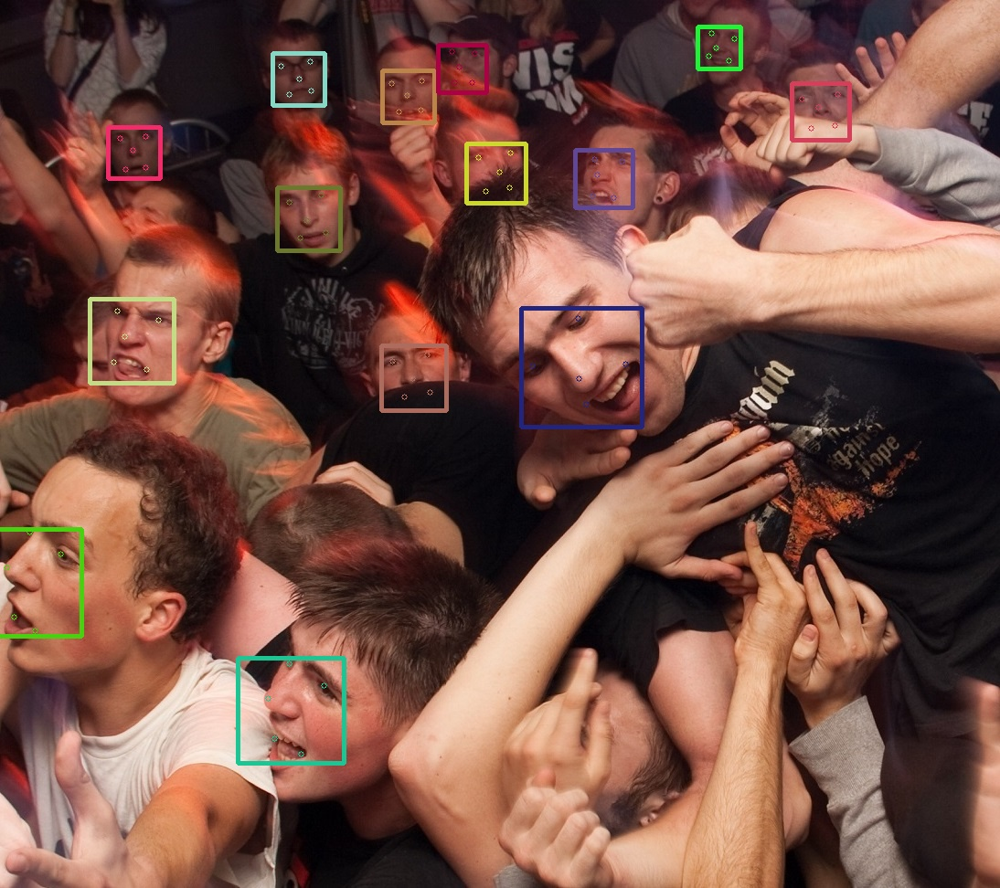

### RSA pycaffe

This repo is a pycaffe port of  RSA, "Recurrent Scale Approximation for Object Detection".
The original version built on Matlab, whose APIs are quite unfamiliar to me, hence I ported it to pycaffe.


#### Usage

First of all, make sure you have had __caffe__ and __pycaffe__ compiled, and then either set __PYTHONPATH=/path/to/caffe__ or modify line 8 in RSA.py `sys.path.insert(0, 'path/to/caffe')` accordingly. Having done with them, simply read an image by opencv and call the function predict(img), it returns a tuple of bounding boxes, keypoints, and number of faces.

For example,

```
    rsa = RSA()

    img = cv.imread('testimg2.jpg')
    bboxes, pts, num_faces = rsa.predict(img)
    bboxes = bboxes.astype(np.int)
    pts = pts.astype(np.int)
    for i in range(bboxes.shape[0]):
        color = (np.random.randint(0, 256),np.random.randint(0, 256),np.random.randint(0, 256))
        cv.rectangle(img,(bboxes[i][0],bboxes[i][1]),(bboxes[i][2],bboxes[i][3]),color,3)
        pt = pts[i].reshape(-1, 2)
        for j in range(pt.shape[0]):
            cv.circle(img, (pt[j,0],pt[j,1]) , 3, color)

    cv.imshow('first', img)
    cv.waitKey()
```

There are tons of settings to explore, if you are brave enough, refer to the official implementation to find out.

```
     input_scale = 0,
     scale = (1,2,3,4,5),
     max_img = 2048,
     min_img = 64,
     anchor_scale = 1,
     factor = 1,
     anchor_box = (-44.7548,-44.7548,44.7548,44.7548),
     thresh_cls = 3,
     stride = 16,
     anchor_center = 7.5,
     anchor_pts = (-0.1719,-0.2204,0.1719,-0.2261,-0.0017,-0.0047,-0.1409,0.2034,0.1409,0.1978),
     nms_thres = 0.2,
     nms_score = 8
```


Finally, if you have a modern GPU(at least GTX1050Ti in my experience), try `python webcam.py`. ^-^


#### Known Issues
For some reasons, reading a JPEG image by Matlab differs from its counterpart in opencv (77 for Matlab but 76 for python), google it and one suggests that libjpeg library may cause this inconsistency. This difference make the predictions vary a bit, for instance, with the same settings, the Matlab version detects 14 faces but pycaffe version could only detects 13. Here is the case,



Somehow, magically, when changing the maximum image size to 1024 (against 2048 in original settings), the pycaffe version detects 14 faces.



And of course, bugs always around, feel free to let me know if it crashes badly.


#### Reference
the official implementation can be found here. [here](https://github.com/sciencefans/RSA-for-object-detection)

python version of matlab function cp2tform. [here](https://github.com/walkoncross/prepare-faces-zyf)

pure python NMS. [here](https://github.com/rbgirshick/py-faster-rcnn)
